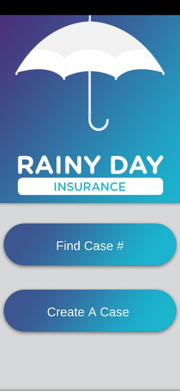
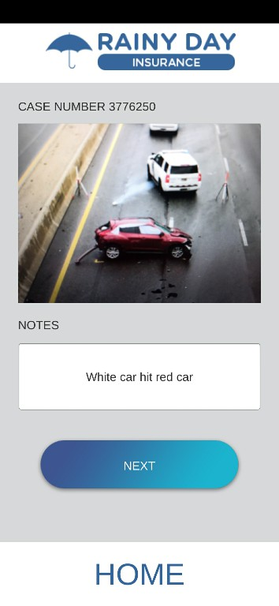
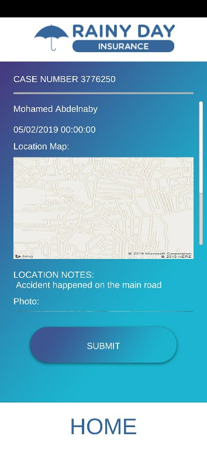
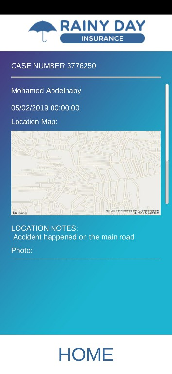

# Rainy Day Insurance
 Rainy Day Insurance is a simple app that lets user document an accident by submitting his own information, static map and notes of the location, photo of accident and notes about it to firebase storage

## Table of contents
* [General info](#general-info)
* [Screenshots](#screenshots)
* [Technologies](#technologies)
* [Setup](#setup)
* [Status](#status)
* [Inspiration](#inspiration)
* [Contact](#contact)

## General info
Application starts by main menu panel and there are two options:
1. Create a Case:
    - User can submit his own:
        - Information
        - Location
        - Accident photo

2. Find a Case:
    - User can search for a case by submitting his case id

## Screenshots

#### Create a Case

#### Find a Case

## Technologies
* Unity - 2018.3
* FirebaseSdk - 5.5.0
* Bing Maps

## Setup
- Open project folder in unity
- Import your own firebase ` google-services.json ` file to assets folder
- Assign your own bing maps api key in location panel Inspector window
- Run the project

## Status
Project is: for development purpose

## Inspiration
Project inspired by [The Ultimate Guide to Real World Applications with Unity](https://www.udemy.com/the-ultimate-guide-to-real-world-applications-with-unity/) udemy course

## Contact
Created by [@Mohamed Abdelnaby Elattar](www.linkedin.com/in/maaelattar) - feel free to contact me!
